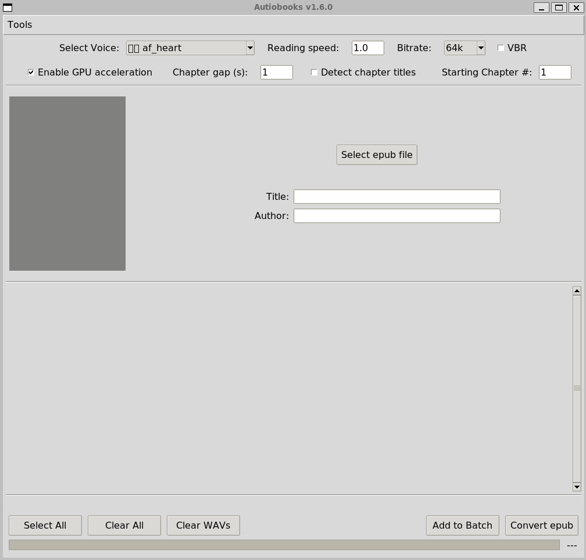

# Autiobooks: Automatically convert epubs to audiobooks
[](https://github.com/plusuncold/autiobooks/actions/workflows/pip-install.yaml)


Autiobooks generates `.m4b` audiobooks from regular `.epub` e-books, using Kokoro's high-quality speech synthesis.



[Kokoro](https://huggingface.co/hexgrad/Kokoro-82M) is an open-weight text-to-speech model with 82 million parameters. It yields natural sounding output while being able to run on consumer hardware.

It supports American, British English, French, Korean, Japanese and Mandarin (though we only-support English, for now) and a wide range of different [voices](https://huggingface.co/hexgrad/Kokoro-82M/blob/main/VOICES.md) with different accents and prosody.

PRs are welcome!

## Changelog

#### 1.1.0 

- Fix race condition - @Thabian

#### 1.0.9

- Fix issue with output file containing multiple audio stream [10](https://github.com/plusuncold/autiobooks/issues/10) - @tomhense
- Add an entrypoint for pipx - @tomhense

#### 1.0.7

- Uptick kokoro package

#### 1.0.6

- Fix chapter index - @tomhense

#### 1.0.5
- Fix pip installs

#### 1.0.3
- Fix bug causing errors on some linux installs
- Read epub files with chapters not marked as ITEM_DOCUMENT
- Select all chapters if none are selected

#### 1.0.2
- Window can be resized

#### 1.0.1
- Initial release


## How to install and run

(Note that pip installs are currently not working - we are looking
into the cause of this, but in the meantime, please download the 
repo and run directly)

If you have Python 3 on your computer, you can install it with pip.
Be aware that it won't work with Python 3.13.

```bash
pip install autiobooks
```

You will require `ffmpeg` and `tkinter` installed:

Linux:
```bash
sudo apt install ffmpeg python3-tkinter
```
MacOS:
```bash
brew install ffmpeg python-tk
```

Also recommended is `espeak-ng` for better processing of unknown words.

To start the program, run:

```bash
python3 -m autiobooks
```

The program creates .wav files for each chapter, then combines them into a .m4b file for playing using an audiobook player.

## Author
by David Nesbitt, distributed under MIT license.
