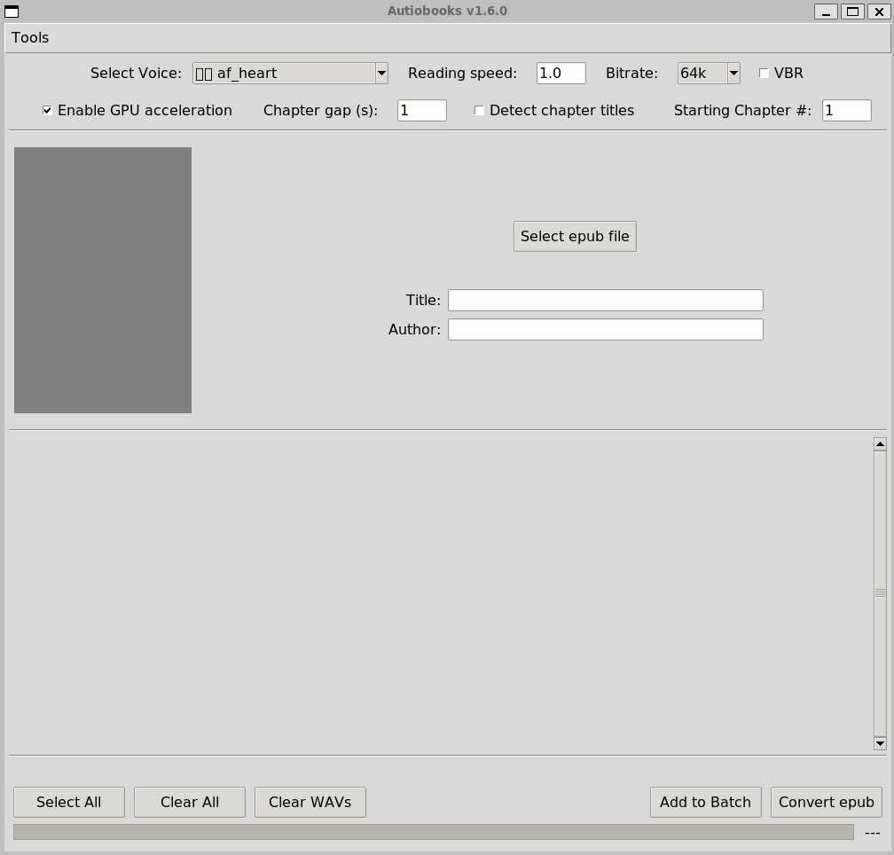

# Autiobooks: Automatically convert epubs to audiobooks
[](https://github.com/plusuncold/autiobooks/actions/workflows/pip-install.yaml)


Autiobooks generates `.m4b` audiobooks from regular `.epub` e-books, using Kokoro's high-quality speech synthesis.



[Kokoro](https://huggingface.co/hexgrad/Kokoro-82M) is an open-weight text-to-speech model with 82 million parameters. It yields natural sounding output while being able to run on consumer hardware.

It supports American, British English, French, Korean, Japanese and Mandarin (though we only-support English, for now) and a wide range of different [voices](https://huggingface.co/hexgrad/Kokoro-82M/blob/main/VOICES.md) with different accents and prosody.

PRs are welcome!

## Features

- **High-quality TTS** — powered by [Kokoro](https://huggingface.co/hexgrad/Kokoro-82M), an 82M parameter open-weight model
- **Multiple voices** — choose from a range of American and British English [voices](https://huggingface.co/hexgrad/Kokoro-82M/blob/main/VOICES.md) with different accents and prosody
- **Chapter selection** — select which chapters to convert, with word counts and text previews
- **Chapter title detection** — automatically extracts chapter titles from the epub's table of contents or headings (can be toggled off)
- **Voice preview** — listen to a sample of any chapter before converting the full book
- **Resume support** — if a conversion is cancelled or fails, previously completed chapters are kept so you can resume without re-converting them
- **GPU acceleration** — CUDA support for significantly faster conversion on NVIDIA GPUs
- **Adjustable settings** — reading speed, chapter gap duration, and starting chapter number
- **Settings persistence** — voice, speed, gap, and other preferences are saved between sessions
- **Cover art** — embeds the epub's cover image into the output `.m4b` file
- **Docker support** — run in a container with X11 forwarding

## Requirements

- **Python** 3.10–3.12 (3.13 is not supported due to dependency constraints)
- **ffmpeg** — required for audio encoding and m4b creation
- **tkinter** — required for the GUI (included with most Python installations)
- **espeak-ng** (optional) — improves pronunciation of uncommon words. Without it, Kokoro handles most text well, but espeak-ng provides a fallback for words the model hasn't seen
- **NVIDIA GPU** (optional) — enables CUDA acceleration for faster conversion. Works with any CUDA-capable GPU. Without a GPU, conversion runs on CPU

## Changelog

#### 1.1.0 

- Fix race condition - @Thabian

#### 1.0.9

- Fix issue with output file containing multiple audio stream [10](https://github.com/plusuncold/autiobooks/issues/10) - @tomhense
- Add an entrypoint for pipx - @tomhense

#### 1.0.7

- Uptick kokoro package

#### 1.0.6

- Fix chapter index - @tomhense

#### 1.0.5
- Fix pip installs

#### 1.0.3
- Fix bug causing errors on some linux installs
- Read epub files with chapters not marked as ITEM_DOCUMENT
- Select all chapters if none are selected

#### 1.0.2
- Window can be resized

#### 1.0.1
- Initial release


## How to install and run

Requires Python 3.10–3.12 (3.13 is not supported).

### 1. Install system dependencies

**Linux:**
```bash
sudo apt install ffmpeg python3-tk espeak-ng
```

**macOS:**
```bash
brew install ffmpeg python-tk espeak-ng
```

**Windows:**
- Install [ffmpeg](https://ffmpeg.org/download.html) and add it to your PATH
- tkinter is included with the standard Python installer
- [espeak-ng](https://github.com/espeak-ng/espeak-ng/releases) is optional but recommended

### 2. Clone and install

```bash
git clone https://github.com/plusuncold/autiobooks.git
cd autiobooks
pip install .
```

### 3. Run

```bash
python -m autiobooks
```

The program creates `.wav` files for each chapter, then combines them into a `.m4b` file for playing using an audiobook player.

### GPU Acceleration

If you have an NVIDIA GPU with CUDA support, check the "Enable GPU acceleration" option in the app to significantly speed up conversion. No additional setup is needed beyond having CUDA-compatible drivers installed.

## Docker

You can run Autiobooks in a Docker container. Since it's a GUI application, you'll need X11 forwarding for display.

### Build and run with Docker Compose

```bash
docker compose up --build
```

Place your `.epub` files in the `./books/` directory — this is mounted as the working directory inside the container.

### X11 Display Setup

**Linux / WSL2:**
```bash
xhost +local:docker
docker compose up --build
```

**Windows (with [VcXsrv](https://sourceforge.net/projects/vcxsrv/) or similar X server):**
```bash
# Start VcXsrv with "Disable access control" checked
DISPLAY=host.docker.internal:0 docker compose up --build
```

**macOS (with [XQuartz](https://www.xquartz.org/)):**
```bash
xhost +localhost
DISPLAY=host.docker.internal:0 docker compose up --build
```

### GPU Acceleration

If you have an NVIDIA GPU and [nvidia-container-toolkit](https://docs.nvidia.com/datacenter/cloud-native/container-toolkit/latest/install-guide.html) installed, the `deploy` section in `docker-compose.yml` enables CUDA acceleration. If you don't have a GPU, comment out or remove the `deploy` section to avoid errors.

### Volumes

| Volume | Purpose |
|--------|---------|
| `./books` | Epub input and audiobook output |
| `autiobooks-config` | Persisted settings between runs |

## Author
by David Nesbitt, distributed under MIT license.
