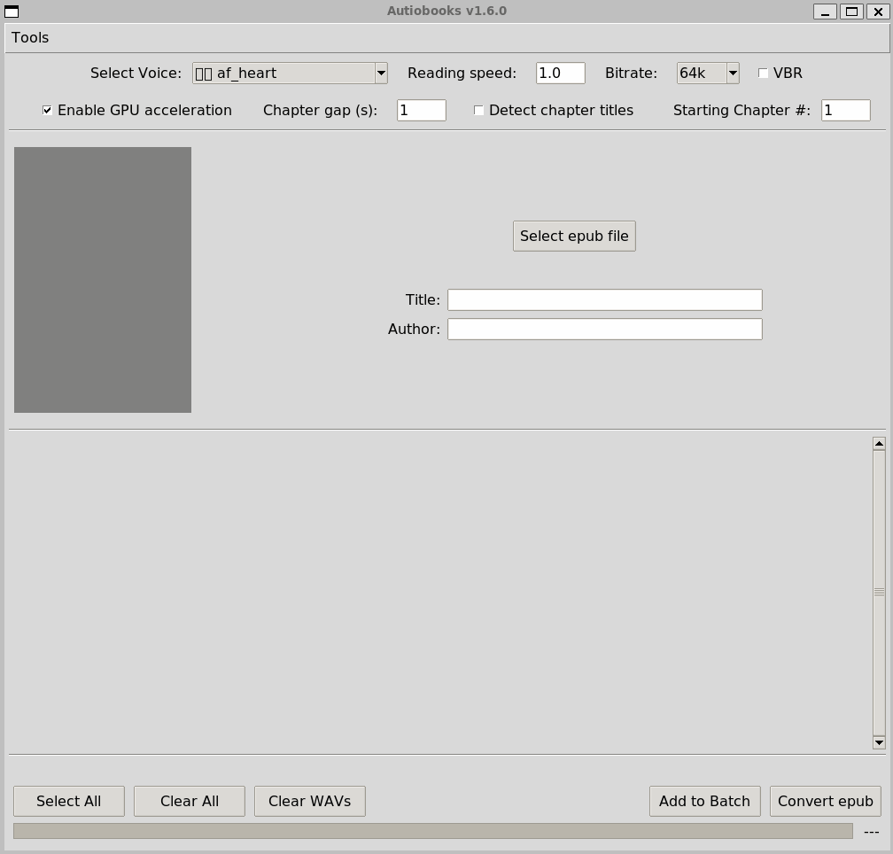

# Autiobooks: Automatically convert epubs to audiobooks
[](https://github.com/tecmage/autiobooks/actions/workflows/ci.yml)


Autiobooks generates `.m4b` audiobooks from regular `.epub` e-books, using Kokoro's high-quality speech synthesis.



[Kokoro](https://huggingface.co/hexgrad/Kokoro-82M) is an open-weight text-to-speech model with 82 million parameters. It yields natural sounding output while being able to run on consumer hardware.

Kokoro supports multiple languages, and Autiobooks exposes all available [voices](https://huggingface.co/hexgrad/Kokoro-82M/blob/main/VOICES.md) across 9 languages: English (US/GB), Spanish, French, Hindi, Italian, Japanese, Portuguese (BR), and Chinese (Mandarin).

PRs are welcome!

## Features

- **High-quality TTS** — powered by [Kokoro](https://huggingface.co/hexgrad/Kokoro-82M), an 82M parameter open-weight model
- **Multiple voices** — 54 voices across 9 languages: English (US/GB), Spanish, French, Hindi, Italian, Japanese, Portuguese (BR), and Chinese (Mandarin)
- **CLI mode** — headless conversion for scripting and automation (`python -m autiobooks convert book.epub`)
- **Hierarchical chapter tree** — browse chapters in a tree view that follows the epub's table of contents structure, with checkboxes, parent-child propagation, auto-select, duplicate detection, and a full-text preview panel
- **PDF support** — open PDF files directly (pypdf, bundled as a required dependency)
- **Multiple output formats** — M4B (with chapters), MP3, FLAC, Opus, or WAV
- **Word substitutions** — user-defined find/replace pairs for fixing TTS mispronunciations
- **Pronunciation overrides** — word→IPA mappings (with JSON import/export) that beat the built-in lexicons, plus optional spellout of unknown acronyms
- **Custom voices** — drop kvoicewalk-style `.pt` voice tensors into `~/.autiobooks/voices/` and they appear in the voice dropdown (marked ✨)
- **Batch queue** — queue multiple books with per-book settings and convert them sequentially
- **Drag and drop** — drag an epub or PDF file directly onto the window to open it (install with `pip install "autiobooks[dnd]"`)
- **Chapter title detection** — automatically extracts chapter titles from the epub's table of contents or headings (can be toggled off)
- **Voice preview** — listen to a sample of any chapter before converting the full book
- **Resume support** — if a conversion is cancelled or fails, previously completed chapters are kept so you can resume without re-converting them. Changing a setting that affects the audio (voice, speed, gap, pronunciation rules) re-converts the affected chapters rather than mixing old and new audio
- **GPU acceleration** — CUDA support for significantly faster conversion on NVIDIA GPUs
- **Adjustable settings** — reading speed, chapter gap duration, bitrate (64/128/192k), VBR mode, output format, and starting chapter number
- **Editable metadata** — correct the title and author before converting
- **Settings persistence** — voice, speed, gap, bitrate, theme, and other preferences are saved between sessions
- **Cover art** — embeds the epub's cover image into the output `.m4b` file
- **Append M4B** — concatenate two `.m4b` files with merged chapter markers via the Tools menu
- **Dark/light theme** — switchable via Settings > Theme
- **Docker support** — run in a container with X11 forwarding

## Requirements

- **Python** 3.10–3.12 (3.13+ is not supported — the Kokoro TTS engine and its `misaki` grapheme-to-phoneme dependency both cap at `<3.13` in their own package metadata)
- **ffmpeg** (with **ffprobe**) — required for audio encoding and m4b creation. Both ship together in every standard ffmpeg package; the app checks for each up front, since ffprobe is what measures the chapter durations the m4b markers are built from
- **tkinter** — required for the GUI (included with most Python installations)
- **espeak-ng** (optional) — improves pronunciation of uncommon words. Without it, Kokoro handles most text well, but espeak-ng provides a fallback for words the model hasn't seen
- **NVIDIA GPU** (optional) — enables CUDA acceleration for faster conversion. Works with any CUDA-capable GPU. Without a GPU, conversion runs on CPU

## Changelog

#### 2.6.0

Fourth full-codebase audit: 39 findings, all fixed.

**Resume no longer splices stale audio** *(the big one)* — a cached chapter was reused whenever its WAV merely existed, so a run cancelled at chapter 30 and resumed under a different voice, speed, gap, or pronunciation setting shipped an audiobook that silently switched voice partway through; a pronunciation-override fix never reached already-cached chapters at all. The cache identity now folds in every render-affecting setting, so changed settings re-synthesize instead of splicing. Regenerating a custom `.pt` (kvoicewalk) between a cancel and a resume is likewise no longer ignored. Caches for unchanged built-in-voice settings stay valid across the upgrade.

**Books that wouldn't open** — an EPUB whose NCX table of contents is degenerate (an empty `navMap`) made ebooklib hand back a shape the app couldn't iterate, so the book failed to load at all. Percent-encoded TOC links (`My%20Chapter.xhtml`) never matched their chapter, and footnote markers tagged `epub:type="noteref backlink"` were read aloud instead of skipped. A PDF whose parent bookmark shares a page with its first child no longer fabricates a duplicate chapter.

**Chapter markers named the wrong chapters** — if a chapter failed transiently (CUDA OOM, a Windows file lock) in a book containing two chapters with identical text, every subsequent m4b marker was shifted onto the wrong audio and the last title was dropped, with no error. Titles now align by index rather than by "did some chapter with this text survive".

**Audio correctness** — "See **Appendix C**" is no longer read as "Appendix 100" (same for `Part D`, `Volume L`, `Chapter M`; genuine `I`/`V`/`X` numerals still convert). Sentence-ending abbreviations keep their pause: *"42 Elm **St.** It was cold"* and *"Fifth **Ave.** The rain fell"* no longer merge into a pauseless run-on. An archery **bow** is no longer voiced as the gesture (*"took the bow and nocked an arrow"*), and *"a big **row** of houses"* is no longer the argument sense. A pronunciation override typed with a keyboard `g` (visually identical to IPA `ɡ`) silently dropped that sound from every occurrence book-wide — it now folds to the character Kokoro was trained on.

**Custom voices** — a `.pt` named without a language prefix (`zoe.pt`) was read as language code `z` and the entire book was silently synthesized in **Mandarin**; `steve.pt` got a US flag and then failed on every chapter. Stems are now validated at discovery with a named warning. A regenerated `.pt` is also picked up instead of being served from a cache that never invalidated.

**Selections and settings are respected** — clicking **Clear All** and then **Convert** used to re-tick and convert the entire book, the exact opposite of the last instruction (the CLI already refused); it now warns instead, before asking for an output path. A hand-edited `config.json` with a bad boolean (`"heteronyms": "enabled"`) crashed the GUI at launch before any window appeared; a mistyped substitution row (`{"find": 123}`) failed every chapter and reported the empty run as partial success. Both now degrade instead of crashing.

**Batch queue** — opening a second Batch Queue window mid-run froze the first window's controls and let closing the duplicate cancel a run it didn't own; the window is now a singleton.

**CLI** — `-q` suppressed *every* fatal startup error while still exiting 1, so a scripted caller saw a bare exit code and no diagnosis; errors now always print. `--chapters 1-999999999999` no longer walks the literal range. Both `ffmpeg` **and** `ffprobe` are checked up front — a box with only `ffmpeg` produced an m4b with every chapter marker at 00:00 after a full TTS run.

**Packaging** — the Windows builds shipped without the pronunciation lexicon and `cmudict`, degrading pronunciation in the frozen app only; `cmudict` was a dev-only dependency despite shipping code importing it. `autiobooks --help` printed a 3-line stub on any installed copy. A `docker compose up --build` in a checkout that had run the Windows build uploaded ~19 GB of build output before starting. The ffmpeg download now verifies completeness and retries instead of silently accepting a truncated zip.

**Split EPUBs read in order** — books processed by Calibre's file splitter (`part0004_split_000.html`, `_split_001`, …) could show dozens of untitled half-chapters dumped at the bottom of the chapter list, with doubled chapter markers in the m4b (one book put each chapter's entire body in a split file its table of contents never mentioned, leaving a 2-word "Chapter 1" stub as the listed chapter). Unreferenced split pieces now merge back into their chapter, and any chapter the table of contents skips is listed at its true reading position instead of the bottom. Table-of-contents links written with backslashes (a quirk of some Windows-built EPUBs) now match their chapters too.

**Tests** — 567 tests (up from 397); heteronym audit harness now 168 cases (166 passing, 2 documented POS-tagger limits), and it now flags cases that pass vacuously.

#### 2.5.0

Third full-codebase audit: 46 findings, all fixed.

**No more silent chapter loss** — a batch job with failed chapters used to report "Completed" (errors went only to stderr), and the CLI printed "Done" and exited 0; batch jobs now show *"Done (N ch failed)"* with the missing chapters listed, and the CLI warns and exits non-zero.

**Audio correctness** — fixed heteronym misfires ("drew the **bow** to his cheek", "a ten **minute** walk", "**middle-aged**", "the **content** of the letter", "**row** between the vines"), `c.`→"circa" mangling lettered lists and "b.c.", and un-expanded `Ave.`/`Blvd.`. Pronunciation overrides pasted with dictionary parentheses (`/ˈlɪs(ə)n/`) no longer silently delete the word from the audio; accented overrides/substitutions (Zoë, résumé) now match; user substitutions beat contraction expansion and heteronym rules; affricates fold to Kokoro's real `ʤ`/`ʧ` codes; auto-acronym spellout no longer corrupts pronunciation markdown or letterizes real words.

**Input parsing** — nested tables no longer read twice; the flagged EPUB cover beats images merely named "cover"; out-of-order PDF outlines no longer drop/duplicate chapters; owner-password-only PDFs open; part-divider pages sit in the right place in the chapter tree.

**Reliability** — a locked WAV can no longer brick conversions until restart; the Batch Queue window can be closed and reopened mid-run without losing status (and no longer re-converts finished jobs over their own output); quitting mid-conversion no longer inhibits system sleep until reboot on Linux/macOS; loading a new book mid-preview no longer wedges previews; CUDA cancel works during extraction and partial installs offer a re-download instead of wedging as "Already Installed"; the footer duration estimate was 60× too small.

**CLI / voices** — the CLI finds the GUI-managed ffmpeg on Windows and fails fast when ffmpeg is missing; a custom `.pt` voice named after a built-in now wins instead of being silently ignored; `--chapters` warns about dropped/invalid ranges; `-h` prints help instead of launching the GUI.

**GUI polish** — closing the Append dialog mid-append asks and genuinely cancels; multi-row delete in Word Substitutions; dark-theme progress bars; gap/chapter range validation on Convert; per-instance preview temp files; no UI freeze on the first preview click.

**Tests** — 391 tests (up from 324); heteronym audit harness now 162 cases (160 passing, 2 documented POS-tagger limits).

#### 2.4.0

**Audio correctness (text handling):**
- **Number ranges are no longer mashed into one word** — a hyphen between bare digits (`10-20`, `3-5`, a `3-2` score) now reads "10 to 20" / "3 to 5" / "3 to 2"; previously misaki glued the digits into a single nonsense token ("tentwenty", "threefive"). The rule fires only when digits flank the hyphen, so `20-year-old`, `Catch-22`, `3-D`, and `F-16` are left intact
- **Typewriter em-dashes no longer fuse the surrounding words** — `wait--no` and `wait -- no` now become a comma pause ("wait, no") instead of "waitno"; a run of `---` was previously deleted entirely, mashing the words together. Standalone `---` / `***` scene-break lines are still removed
- **Degree signs no longer glue to the unit** — `98.6°F` reads "98.6 degrees F", not "degreesF" (which Kokoro voiced as one slurred word); `100°C` → "100 degrees C"
- **`Part MIX` is no longer "Part 1009"** — `MIX` (and `DIV`) are valid Roman numerals but far more often ordinary words; the roman pass now leaves any c/d/l/m token that spells a dictionary word alone, while genuine numerals (`XI`, `VII`, `XIV`, `MCM`) still convert
- **Sentence-ending abbreviations keep their pause** — `"…and so on, etc. Then he left."` no longer collapses into "et cetera Then he left." (the period that doubled as the sentence stop was being eaten); `etc.` / `et al.` retain a period only at a real sentence boundary, never mid-sentence and never for titles like `Mr.`
- **Stat/status tables read naturally instead of one-cell-at-a-time** — LitRPG/progression-fantasy status screens are HTML tables, and each cell ("Strength:", "432", "Mana:", "306"…) was being read as its own isolated utterance, so the whole block dragged and went flat. Table rows now flatten to a single flowing line (*"Strength: 432, Mana: 306, Armor: 2679"*)
- **"Los Angeles" no longer says "Lohz Angeles"** — *Angeles* was already corrected, but *Los* was being voiced /loʊz/ (rhyming with "rose"); it now reads /lɔs/ ("loss"), and the fix also covers Los Alamos / Los Gatos without touching names like Carlos or Marcos
- **"prayer" now rhymes with "air"** — it was being read as the two-syllable "PRAY-er" (one who prays) instead of the one-syllable devotion sense (*she said a prayer*); both singular and plural are fixed. Also added the verb ***frequent*** (free-KWENT, *they frequent the bar*) vs the adjective (FREE-kwent), and the adjective ***consummate*** (kuhn-SUM-it, *a consummate professional*) vs the verb
- **More heteronyms pronounced correctly** — a deep-dive audit added handling for attributive `-ed` adjectives (*a **learned** man*, *a **blessed** event*, *an **aged** man*, *a **cursed** sword* now take the two-syllable "-id" pronunciation, distinct from the verbs *she learned*, *he cursed*); ***beloved*** is now three syllables (be-LUV-id); and the verb ***delegate*** (de-le-GATE) is distinguished from the noun (DEL-uh-gut). Also fixed two existing-rule misfires: *the **minute** hand* / *the **minute** book* are no longer read as "my-NOOT" (tiny), *a **minute** amount* now correctly **is** "my-NOOT", and *she tied a **bow** in her hair* is the /boʊ/ ribbon, not the /baʊ/ bend
- **"content creator" is no longer mispronounced as the adjective** — the heteronym rule that switches `content` to the "satisfied" pronunciation (con-TENT) on a nearby "is/was/feel…" was firing on noun compounds like *"he is a content creator"* / *"the content manager"*, where it should stay the noun (CON-tent). It now keeps the noun pronunciation whenever `content` directly precedes another noun
- **LitRPG stat-block arrows no longer reach the narration** — progression-fantasy chapters use a zoo of arrow glyphs (`➔`, `⇒`, `➜`, `⟶`, `⮕`) in skill/stat lines like `Skill (lv50) ➔ Skill (lv60)`; only the basic `←↑→↓` were stripped before, so the fancier variants were read aloud as gibberish. Every arrow variant is now removed. (Found by sampling 42 real chapters across six Royal Road fictions through the conversion pipeline)

**Contraction handling:**
- **Possessives are no longer turned into "is" / "has"** — the contraction expander keyed only on the word *after* `'s`, so possessive noun phrases followed by a participle were corrupted (`the book's torn pages` → "the book **has** torn pages", `the city's growing population` → "the city **is** growing population"). It now keys on spaCy's tag for the clitic itself, so possessives are left alone while genuine contractions still expand correctly
- **Contraction expansion is now off by default** — Kokoro already pronounces contractions correctly on its own, so the expansion carried risk (see above) with no pronunciation benefit. The *Contraction resolution* checkbox in Preferences (and the CLI `--contractions` flag) still turn it on; existing saved settings are preserved

**Tests:**
- New regression coverage for contraction disambiguation, numeric ranges, em-dashes, degree units, and the roman-numeral word guard

#### 2.3.0

**Audio correctness:**
- **The pronoun "I" is no longer read as "1"** — the roman-numeral pass matched `book I` / `part I` / `act I` case-insensitively, so first-person prose like *"The book I read"* became *"The book 1 read"*. Bare single-letter numerals now convert only with a capitalized keyword ("Book I covers…") or at the end of a line/clause ("chapter i."); strict roman validation also stops `VV` → 10
- **User pronunciation overrides now genuinely always win** — overriding a word the built-in contextual rules also handle (`bowed`, `resume`, …) used to produce nested `[[word](/a/)](/b/)` markdown that misaki read as garbage. Built-in markdown-emitting passes now skip user-configured words, and substitutions/overrides skip matches inside existing markdown
- **Heteronym context windows stop at sentence boundaries** — *"They take the stage. Bow strings snapped."* no longer borrows "take" from the previous sentence to force the wrong sense of "Bow" (same for content/bass/row/lead/tearing)
- **"Thanks, Ed." is no longer "Thanks, Edition"** — `Ed.` expands only after a digit/ordinal (`2nd Ed.`), joining the context-aware `St.`/`No.` resolvers
- **Acronym spellout no longer letterizes shouting** — with *Spell out unknown acronyms* enabled, all-caps emphasis (`STOP`, `THE END`) and roman numerals beyond XII (`XIII`) kept their pronunciation instead of becoming `S. T. O. P.`
- **Non-decomposable letters reach the TTS** — `æ Æ œ Œ ø ß ł đ ð þ` now fold to ASCII (`Encyclopædia`, `Brontë's œuvre` were silently dropped); URLs are still stripped but no longer eat the comma/period after them

**CLI ↔ GUI parity:**
- **The CLI now follows your saved GUI preferences** — voice, heteronyms, contractions, and read-title-author default to what you set in the app; new `--heteronyms/--no-heteronyms`, `--contractions/--no-contractions`, and `--read-title-author/--no-read-title-author` flags override per-run
- **CLI prepends "Title by Author" to chapter 1** exactly like the GUI, so chapter-1 resume caches interoperate between the two
- **Headless CLI** — the console script dispatches CLI commands before any GUI import; `autiobooks list-voices` works on a server without tkinter/pygame
- **One duplicate-detection policy** (new `selection.py`) — the GUI tree and CLI auto-select previously disagreed on whitespace-variant and empty chapters
- **Shared assembly path** (`engine.assemble_output`) — GUI, batch, and CLI used three drifted copies of the post-TTS assembly block; relative input paths (`convert books/x.epub`) no longer break ffmpeg concat
- Friendly errors for encrypted PDFs and corrupt files instead of tracebacks

**Structural fixes:**
- **PDF outlines build the correct chapter tree** — every multi-entry outline previously nested all chapters under the first one, pushing chapter one's own text to the end of the tree
- **A cover image PIL can't decode no longer aborts the whole book load** (SVG covers, corrupt JPEGs) — the book opens with the placeholder cover
- **EPUB cache is evicted on book switch** — browsing many books in one session no longer grows memory without bound; toggling *Detect chapter titles* off now actually clears previously detected titles
- **Batch queue race closed** — removing a pending job at the exact moment the worker picked it up could yank the job mid-handoff; the `[n/total]` counter no longer overflows when jobs are added mid-run; batch run state survives closing and reopening the queue window; quitting the app now signals a running batch to stop at the chapter boundary

**Reliability:**
- **Final output files are written atomically** — a crash or kill mid-mux can no longer leave a truncated `.m4b`/`.mp3` at your chosen path that looks finished but isn't
- **ffmpeg runtime extraction is atomic and self-healing** — a kill mid-download used to leave a permanently broken `ffmpeg.exe` that passed the existence check on every later launch; the binary is now validated each start and re-downloaded if broken
- **CUDA download dialog no longer crashes when closed via the X** (now acts as Cancel)
- **ffprobe failures show the actual cause** instead of `returned non-zero exit status 1`
- **Preview and conversion are mutually exclusive** — generating a preview mid-conversion shared the TTS pipeline and global torch device state with the worker (mixed-device crash risk); preview errors also surface properly now (a variable-capture bug silently swallowed them)
- A corrupt `config.json` substitution/override list degrades to empty instead of crashing mid-conversion; Clear WAVs is blocked while a batch is converting the same book

**Tests/docs:**
- 36 new regression tests (300 total, incl. new PDF outline-shape suite), end-to-end CLI conversion verified, all reference docs (API_REFERENCE/THREADING_MODEL/ERROR_HANDLING/DATA_FLOW) re-synced against the code; `setup.py` removed (poetry-core is the only build path)

#### 2.2.0

**Audio correctness:**
- **FLAC output contained only chapter one** — the ffmpeg concat demuxer silently keeps just the first segment when stream-copying raw FLAC; assembly now re-encodes (lossless, bit-faithful audio). Every prior multi-chapter FLAC conversion was affected
- **Ellipses are no longer deleted** — the scene-break stripper had `.` in its character class, so every `...` (and `…`, which normalizes to `...`) vanished, erasing trailing-off pauses and even sentence stops (`"No... I will not."` → `"No I will not."`) book-wide
- **Chapters follow the EPUB spine** (reading order) instead of manifest order — books whose manifest isn't written in reading order produced shuffled audio while the chapter tree looked correct
- **Roman numeral false positives fixed** — `"part mix"` no longer becomes `"part 1009"`; lowercase numerals are only accepted when built from i/v/x (`chapter iv` still works)
- **Abbreviations expand before punctuation** — `Smith et al., 2020`, `(etc.)`, and `etc."` previously stayed unexpanded
- **Word-boundary fixes** — whole-word substitutions with symbol edges (`$100`) now match; pronunciation overrides anchor per-edge so `O'Brien` keeps both boundaries; words with phoneme overrides are protected from auto-acronym spellout

**Output metadata:**
- **MP3/FLAC/Opus outputs now carry title/artist/album tags**, and MP3/FLAC embed the cover art (previously non-M4B files had no metadata at all)
- **PDF covers are embedded in M4B output** from the GUI and batch queue (previously CLI-only)

**Reliability:**
- **Single-conversion guard** — the main Convert flow and the Batch Queue are now mutually exclusive (both flip global torch GPU state and share per-book WAV paths); the conversion worker reads all settings from main-thread snapshots, so loading another book mid-run can no longer corrupt titles/cover of the conversion in flight
- **Cancelling the CUDA download no longer freezes the app** until the full 2.5 GB completes; the download offer is suppressed on CPU-only torch builds (the DLLs can't activate there), and "Don't ask again" now works when answering No
- **Conversion state fixes** — wrong-book conversion with auto-select off (stale chapter selection), failed book loads no longer half-swap state, the voice dropdown stays read-only after converting, per-chapter progress no longer jumps straight to ~95%, fully-selected sections show a proper checkmark instead of the indeterminate dash
- **Append M4B refuses output = input** — writing onto the base file mid-read destroyed it
- **Misc:** corrupt `config.json` no longer crashes startup; duplicate pronunciation-override words are rejected (they nest markdown and garble audio); Preferences persist on window-X close; preview validates speed and handles empty chapters gracefully; closing mid-conversion asks for confirmation; settings saved by one component no longer get wiped by another's save

**Tests/CI:**
- ~40 new regression tests (`test_config.py`, `test_epub_parser.py` with a spine-order fixture, ellipsis/roman/abbreviation/boundary/spellout classes); CI now installs dev extras and runs the test suite on every push

#### 2.1.1

**Pronunciation fixes:**
- **`blaise → /bleɪz/`** — added to the built-in proper-noun overrides; the given name was absent from misaki's gold/silver lexicons so it fell through to espeak's letter-rule G2P, which is unreliable for non-English etymology
- **`dives → /daɪvz/`** — fixes a misaki silver lexicon bug: the lowercase entry shipped with the biblical proper-noun pronunciation `/ˈdaɪvˌiːz/` (two syllables, stressed first-then-second), turning every everyday verb/plural ("she dives in", "five dives") into the Luke-16 character. The override is case-insensitive so capitalized `Dives` also gets the verb reading — acceptable trade-off because the biblical character is vanishingly rare in modern reading material
- **`résumé` (CV/noun) preserved before diacritic strip** — misaki gold has only the verb pronunciation `/ɹəzˈum/`, so `résumé` was previously read as the verb "to continue" after `strip_diacritics` erased the accent cue. New `_RESUME_NOUN_RE` runs inside `normalize_unicode` *before* the strip and wraps any accented spelling (`résumé`, `Résumé`, `resumé`, `résume`, plus their `-s` plurals) as `[resume](/ˈɹɛzəmeɪ/)` markdown; plain unaccented `resume` is untouched and keeps misaki's verb default

**Custom voices (beta):**
- **Drop-in `.pt` voice packs** — place PyTorch voice tensors in `~/.autiobooks/voices/` and they appear in the voice dropdown alongside Kokoro's 54 built-in voices, marked with a ✨ sparkle (e.g. `✨ 🇬🇧 bm_steve`). Compatible with files produced by [kvoicewalk](https://github.com/RobViren/kvoicewalk). Tensors are loaded with `weights_only=True`, kept on CPU regardless of GPU setting, and validated as shape `(N, 1, 256)` at load time so a malformed file fails with a named error instead of crashing inside synthesis
- **Tools → Open Voices Folder…** — creates the directory if missing and opens it in the system file browser; the voice dropdown re-scans on next click so newly added files appear without restart
- Voice names follow Kokoro's `<lang><gender>_<name>` convention (e.g. `bm_steve.pt` is treated as British male) so the language-flag emoji and language routing work without extra configuration
- **Beta:** API and discovery behavior may change before the feature graduates; no in-app voice-pack training UI yet — `.pt` files must be produced externally (e.g. with kvoicewalk)

**Test additions:**
- 13 new cases in `tests/test_text_processing.py`: `TestResumeNounPreservation` (9 cases covering accented variants, plain-word passthrough, verb inflections, non-English language code, full-pipeline survival) and four additions to `TestBuiltinPhonemeOverrides` (blaise/dives wrapping, case-insensitive `Dives`, user override preempts builtin)

#### 2.1.0

**Pronunciation control:**
- **Pronunciation Overrides** (Tools → Pronunciation Overrides) — user-defined word→IPA mappings; matches are wrapped as `[word](/IPA/)` markdown so misaki assigns rating 5 (beats gold/silver/espeak); auto-drops the `\b` word-boundary anchor for words containing apostrophes or hyphens (handles `O'Brien`, `Anne-Marie`); per-entry case-sensitivity and enable/disable toggle; English-only
- **Import / Export JSON** for pronunciation overrides — share override sets between machines or seed a new install from `scripts/sample_overrides.json` (~250 high-confidence inflected-form fixes generated by the new audit script)
- **Auto-acronym spellout** (Preferences → Spell out unknown acronyms, off by default) — rewrites unknown all-caps tokens (`NATO`, `CIA`) as letter-spelled phonemes (`N. A. T. O.`); skips a hard stoplist of roman numerals (II–XII) plus pronounceable acronyms misaki only stores lowercase (SCUBA, LASER, RADAR, etc.); runs after word substitutions so a rewrite like `NATO → North Atlantic Treaty Organization` suppresses spellout
- **Contextual heteronym overrides** — words whose pronunciation depends on collocation cues that POS alone can't resolve: `bow`/`bows`/`bowed`/`bowing` (bowing-gesture vs archery/violin), `content` (predicate adjective vs noun), `minute` (adjectival "tiny" vs time-unit), `lead` (metal/material vs verb), `bass` (musical instrument vs fish), `row` (argument vs line/boat), `tearing` (cry sense vs rip). Each rule fires only on positive context evidence so misaki's POS-aware gold lookup still wins for ambiguous tokens.

**Pronunciation audit harness:**
- **`scripts/audit_pronunciations.py`** — diffs misaki's emitted phonemes against cmudict for the top-N English words and writes `suggested_overrides.json` (HIGH confidence) and `pronunciation_audit.csv` (full report) so override sets can be regenerated from authoritative source
- **`scripts/audit_heteronyms.py`** — runs ~120 (sentence, target word, expected IPA) cases through the full normalize_text → misaki pipeline; passes 121/123 today; the 2 failures (`contract` and `does` in rare contexts) are documented inline as known POS-tagger limits
- **`scripts/sample_overrides.json`** — bundled, ready to import via Tools → Pronunciation Overrides → Import JSON…

**Batch queue improvements:**
- **Live treeview update** — adding a job from the main window while a batch is running now appears in the open Batch Queue immediately; previously it was deferred until the running job finished
- **Reorder pending jobs mid-run** — Move Up / Move Down / Remove stay enabled during a batch but only act on jobs past the running one; the running row is marked with `▶` and bold text so it's visually distinct
- **Clear All becomes "Clear Pending" mid-run** — confirmation dialog says how many pending jobs will be removed; the currently-running job continues unaffected

**Critical bug fixes (audio quality):**
- **IPA alphabet folding for Kokoro** — Kokoro's phoneme vocab indexes character-by-character and only carries single-letter tokens for the five English diphthongs (`A`=eɪ, `I`=aɪ, `O`=oʊ, `W`=aʊ, `Y`=ɔɪ; `Q`=əʊ for GB). Sending raw canonical IPA (`bˈaʊd`) made Kokoro read `a` (vocab id 43) and `ʊ` (id 135) as two unrelated phonemes instead of the diphthong `W` (id 39); the duration predictor destabilized and the override audio bled onto neighbouring words ("baud" appeared where it didn't belong, the wrapped word came out as "boud"). New `_to_misaki_phonemes()` folds canonical diphthongs to misaki's single-letter codes before emitting markdown — both contextual rules and user-entered overrides now feed Kokoro the alphabet it was trained on
- **Misaki preprocess whitespace patch** — `misaki.en.G2P.preprocess` used `text.split()` to build its source-token list, discarding `\n` and every other whitespace run. spaCy's tokenizer keeps those as separate tokens, so on multi-paragraph text the source-token list ended up several hundred tokens shorter than the spaCy mutable list and `Alignment.from_strings` drifted further with every paragraph break. By mid-chapter, every `[word](/IPA/)` markdown wrapping attached its rating-5 IPA to a `?`/`\n`/unrelated-word mutable_token instead of the actual word — the override silently fell back to misaki's gold (e.g. `bowed → bˈOd` archery sense) AND the IPA leaked audibly onto whatever wrong token absorbed it. `engine.py:_patch_misaki_preprocess()` monkey-patches the system misaki at import time with a `re.split(r'(\s+)', s)` variant that keeps whitespace runs as source tokens; bundled `autiobooks/misaki/en.py` carries the same fix in-place for PyInstaller builds
- **Hash-derived chapter WAV filenames** — resume now uses `{stem}_chapter_{md5_8}.wav` keyed on the chapter's text, so reshuffling or shrinking the selected chapter set between runs can't feed one chapter's audio into another chapter's slot. Two chapters with identical text deliberately share a wav path (the audio is identical, so re-using is correct).

**Other fixes:**
- macOS-specific GUI fixes (Mac bug fixes 1 + 2)
- Book Info panel now renders plain text for EPUB `dc:description` metadata that's stored as HTML (`<p>…</p>`, `<br/>`, entities) instead of showing raw HTML tags
- GUI cleanup for PDF input
- Windows build script fix

**Test infrastructure:**
- pytest suite (`tests/test_text_processing.py`, `tests/test_cli.py`) — 207 cases covering normalization, diacritics, fractions, abbreviations (including the context-aware `St.` Saint/Street and `No.` Number resolvers), roman numerals, heteronyms, special characters, substitutions, phoneme overrides (user + built-in proper-noun defaults), acronym spellout, the diphthong-folding helper, and the misaki preprocess whitespace patch (multi-paragraph regression suite that catches alignment drift the single-sentence audit harness cannot detect)

#### 2.0.0

**New features:**
- **CLI mode** — headless conversion for scripting and automation: `python -m autiobooks convert book.epub -o book.m4b --voice af_heart`; also `list-chapters` and `list-voices` subcommands; auto-selects non-empty non-duplicate chapters; supports resume, ETA display, and all format/quality options
- **Multi-language voices** — all 54 Kokoro voices now available across 9 languages: English (US/GB), Spanish, French, Hindi, Italian, Japanese, Portuguese (BR), and Chinese (Mandarin); text normalization automatically skips English-specific steps for non-English voices

**Dependency upgrades:**
- **Kokoro 0.9.4** — upgraded from 0.7.9; scipy dependency removed (smaller install), numpy unpinned, MPS (macOS GPU) support added
- **Misaki 0.9.4** — upgraded from 0.7.17; improved pronunciation dictionaries, restructured MToken dataclass
- **phonemizer-fork** — replaces phonemizer as the espeak backend dependency

**Text normalization improvements:**
- **Diacritics stripping** — accented words (café, naïve, résumé) are normalized to ASCII so they match the TTS lexicon instead of being silently dropped
- **Fraction expansion** — Unicode fractions (½, ¼, ¾, ⅓, etc.) are expanded to spoken English ("one half", "one quarter")
- **Expanded abbreviations** — 22 new entries: military ranks (Pvt., Cpl., Maj., Brig.), ecclesiastical (Fr.), geographical (Rd., Ln., Hwy., Mt., Ft.), publishing (Ch., pp., Vol., No., Ed., Fig., Pt.)
- **Expanded symbol handling** — §, ∞, ≈, ≠, ≤, ≥ expanded to English words; decorative symbols (¶, †, ‡, arrows, stars) removed
- **Heteronym fix** — removed wind, tear, wound overrides that conflicted with misaki's native POS-aware pronunciation; kept read/lead disambiguation

**Dark mode improvements:**
- Fixed button text, combobox arrows, dropdown lists, tooltips, radio buttons, label frames, and paned windows not being properly themed in dark mode
- New dialogs (Preferences, Word Substitutions) now automatically inherit dark theme colors via Tk option database defaults
- Combobox dropdown lists use dark theme colors

**Bug fixes:**
- Fixed checkboxes in chapter tree not responding to clicks on some Tk versions (dual `identify_region`/`identify_element` detection)
- Fixed expand/collapse arrows not working in chapter tree view
- Widened Preferences and Word Substitutions dialogs to prevent text cutoff
- Fixed GPU acceleration not resetting to CPU when unchecked — `set_gpu_acceleration(False)` previously left torch's default device stuck on CUDA/MPS from a prior run
- Fixed duplicate chapter detection being inconsistent between sessions — now uses stable `hashlib.md5` instead of Python's randomized built-in `hash()` (which is re-seeded per interpreter run)
- Fixed `prevent_sleep()` context manager leaking sleep-inhibit state on exceptions and re-yielding on caller errors; now cleans up correctly regardless of how the `with` block exits
- Fixed CUDA download leaving corrupt whl files on disk when interrupted — downloads are now atomic (`.part` → rename) with zip validation and a one-shot retry on truncation or corruption
- Fixed voice preview polling loop spawning overlapping `root.after()` chains when the user clicked play rapidly — a single tracked after ID is now cancelled before each new preview
- Fixed CLI progress output using `\r` carriage returns when stderr isn't a TTY — piped and redirected logs now get plain newlines
- Fixed `get_chapter_titles()` returning `None` entries when the TOC had no title and no heading could be extracted — now always returns strings
- Fixed cover image tempfile leaking if the write failed mid-way — path is now recorded before the write so `finally` cleanup always runs
- Added `timeout=30` to all `ffprobe` calls (`probe_duration`, `_probe_chapters`, `_probe_format_tags`) so a hung ffprobe can no longer freeze the caller indefinitely
- Config loader now validates numeric fields (`speed`, `chapter_gap`, `starting_chapter`) before inserting them into entry widgets so a corrupt config does not crash conversion at float/int cast time
- FFmpeg stderr-drain threads now guard against read failures and record the error in the stderr buffer instead of dropping it silently
- Append dialog now logs the underlying ffprobe exception to stderr and shows the exception type in the status label instead of a generic "could not read file"
- Append dialog now validates that the output directory exists and is writable before starting, so long appends don't fail partway through due to permissions
- Batch queue WAV/M4A cleanup now logs unlink failures to stderr instead of giving up silently on the last retry
- CLI PDF metadata path now uses the shared `get_title`/`get_author` helpers (PdfBook already implements `get_metadata`), eliminating a duplicate try/except block
- Fixed CLI crash at the end of every successful conversion — `cmd_convert` referenced a bare `start_time` at module scope instead of `state['start_time']`, raising `NameError` after the final chapter
- Main conversion thread now wraps `run_conversion` in a top-level try/except/finally so an unexpected exception inside `prevent_sleep()` or the conversion loop can no longer leave the UI stuck with Convert disabled and Cancel enabled — the error surfaces in a dialog and controls always re-enable
- `save_config` now prints a warning to stderr on `OSError` instead of silently swallowing it, so users can tell when settings aren't being persisted (disk full, read-only home, permissions)
- Fixed macOS GPU acceleration being effectively broken. Even with "Enable GPU acceleration" ticked, Kokoro ignored `torch.set_default_device('mps')` because its constructor only auto-detects cuda-or-cpu — the model loaded on CPU while intermediate tensors went to MPS, causing a `RuntimeError: Expected all tensors to be on the same device` crash during TTS. `create_pipeline` now passes `device=…` to `KPipeline` explicitly, and the pipeline cache is invalidated whenever the device changes so toggling GPU mid-session actually takes effect
- Fixed the "Enable GPU acceleration" checkbox staying greyed out on Apple Silicon Macs. The visibility logic only enabled the checkbox when `torch.cuda.is_available()`, so an MPS-capable Mac fell into the "needs CUDA-enabled build" tooltip branch even though `set_gpu_acceleration(True)` would have routed correctly to MPS. Now enables for either CUDA or MPS
- Config restore in `start_gui()` now calls `set_gpu_acceleration(...)` immediately after syncing the tk var, so the first preview before the first Convert click respects the saved GPU preference instead of running on CPU

**Batch queue improvements:**
- Batch queue now shares the single conversion loop (`engine.convert_chapters_to_wav`) used by the GUI and CLI, so jobs get per-chapter progress/ETA, chapter-error handling, and the same TTS pipeline as the main window
- Batch queue now supports resume — cancelling or hitting an error keeps partial WAVs so the next batch run picks up where it left off
- Batch queue now disables Move Up / Move Down / Remove / Clear All buttons while a run is active so the queue can't be mutated mid-iteration
- Batch queue now snapshots the main-window GPU preference at the start of the run and restores it in a `finally` block after the last job, instead of leaving `torch`'s default device on whatever the final job was configured with
- Batch queue now detects output filename collisions between queued jobs (e.g. two EPUBs with the same stem exporting to the same folder) and appends ` (2)`, ` (3)`, … to later writes; comparison is case-insensitive so Windows/macOS don't overwrite on case
- Batch cleanup now reads the real encoded intermediate paths out of `encode_futures` instead of re-deriving them from the job stem — formerly drifted if `safe_stem` truncation kicked in
- Batch worker now has a top-level try/except/finally that catches any unexpected crash in the loop, logs a traceback, shows an error dialog, and always re-enables the queue mutation buttons and Start button — a crash mid-queue can no longer leave the window half-disabled
- Batch Treeview now shows Format and Bitrate columns for each job

**Refactoring:**
- Extracted the chapter conversion loop (~80 lines) shared between the CLI and GUI conversion paths into `engine.convert_chapters_to_wav()`; callers pass a prepared text list and callbacks (`on_chapter_start`, `on_segment`, `on_chapter_done`, `on_chapter_error`, `cancel_check`) to drive their own progress UI
- Split the ~2000-line `start_gui()` god function into focused modules: `theme.py` (themes and `apply_theme`), `dialogs.py` (append/preferences/substitutions dialogs), `batch_window.py` (batch queue window and conversion loop); metadata helpers (`get_publisher`, `get_publication_year`, `get_description`) moved to `epub_parser.py`. `autiobooks.py` dropped from 2038 to 1289 lines; extracted modules take state via explicit parameters instead of closing over `start_gui`'s scope.

**CLI improvements:**
- Added `--no-resume` flag to force re-conversion of all chapters even when cached WAV files exist

#### 1.7.0

**Chapter tree view** (inspired by [abogen](https://github.com/denizsafak/abogen)):
- **Hierarchical chapter selector** — flat checkbox list replaced with a `ttk.Treeview` that follows the epub's TOC structure (Part > Chapter > Section)
- **Image-based checkboxes** — checked, unchecked, and half-checked states drawn with PIL (ttk.Treeview has no native checkboxes)
- **Parent-child propagation** — checking a parent section checks all its children; parent state updates automatically when children change
- **Content preview panel** — right-side pane shows the full text of the selected chapter, or book metadata (title, author, publisher, year, description) when no chapter is selected
- **Auto-select** — non-empty, non-duplicate chapters are automatically selected when a book is loaded
- **Duplicate detection** — chapters with identical content are marked "(Duplicate)" and excluded from auto-select
- **Expand/Collapse All** — toolbar buttons for navigating large TOC hierarchies
- **Content caching** — parsed epub data is cached in memory keyed on (path, mtime, resize); reopening the same file skips re-parsing

**New features:**
- **PDF input** — open PDF files directly; text extracted page-by-page via pypdf (BSD-3-Clause, now a required dependency), chapter structure from PDF bookmarks/outline
- **Multiple output formats** — choose M4B, MP3, FLAC, Opus, or WAV from the format dropdown; M4B retains chapter markers, other formats concatenate into a single file
- **Word substitutions** — user-defined find/replace pairs (Tools > Word Substitutions) for fixing recurring TTS mispronunciations of names, places, or terms; supports case-sensitive and whole-word matching; saved between sessions
- **Heteronym disambiguation** — spaCy POS tagging resolves ambiguous words like "read" (reed/red) and "lead" based on grammatical context
- **Contraction resolution** — spaCy-based expansion of ambiguous contractions ("'s" → is/has, "'d" → would/had) using surrounding context
- **Prevent system sleep** — OS-level sleep inhibition during conversions (Windows, macOS, Linux) so long books don't fail because the machine went to sleep
- **Dark/light theme** — switchable via Settings > Theme; preference saved between sessions

#### 1.6.0

**Windows Builds:**
- Two standalone Windows executables via PyInstaller:
  - **CPU build** (`dist/autiobooks/autiobooks.exe`): CPU-only torch, GPU checkbox disabled (grayed out)
  - **CUDA build** (`dist-cuda/autiobooks-cuda/autiobooks-cuda.exe`): Full GPU acceleration, checkbox enabled by default
- Bundled ffmpeg and espeak-ng (downloaded at build time)
- Bundled spacy + en_core_web_sm for proper NLP tokenization (both builds)
- GPU checkbox shows but is disabled on CPU build with tooltip explaining CUDA build is needed
- "Don't ask again" preference for CUDA prompt (saved to config)
- Tools > Download CUDA Support... for manual download (bypasses "Don't ask again")

#### 1.5.0

**New features:**
- **Batch queue system** — "Add to Batch" button captures the current epub with all its settings (selected chapters, voice, speed, gap, detect titles, starting chapter) into a queue
- **Batch Queue window** (Tools > Batch Queue...) — view, reorder, remove queued jobs, select output directory, and start batch conversion
- Sequential batch conversion with per-job progress tracking and ETA
- Per-file error handling — failures don't stop the batch, summary shown on completion

#### 1.4.0

**New features:**
- **Configurable bitrate** — choose 64k, 128k, or 192k AAC output (default 64k); setting is saved between sessions
- **VBR mode** — new VBR checkbox uses AAC variable bitrate (`-q:a 2`, ~96–128 kbps) for better quality-to-size ratio; disables the bitrate dropdown when active
- **Editable metadata** — a dialog before conversion lets you correct the title and author extracted from the epub
- **Clear WAVs button** — new button in the chapter list toolbar deletes leftover `_chapter_*.wav` files for the current book without navigating to the filesystem
- **Chapter numbers** — chapter list now shows a sequence number (1, 2, 3…) before each title, counting only non-empty chapters

**GUI improvements:**
- Chapter list footer shows total selected chapters, word count, and estimated listening duration (updates live as checkboxes or speed change)
- Save As dialog remembers the last-used output directory separately from the epub input directory
- Append M4B dialog shows chapter count and duration for each selected file after browsing
- Append M4B dialog validates that input files exist and are `.m4b` before starting

**Bug fixes:**
- Cancelling a conversion now also cancels any queued background AAC encoding jobs, not just the TTS loop

#### 1.3.0

**New features:**
- **Append M4B** — new Tools menu with "Append M4B files..." dialog to concatenate two m4b files; chapter markers from both files are merged with correct timestamps, cover art and metadata are taken from the base file

**GUI improvements:**
- Starting Chapter # field moved next to the Detect chapter titles checkbox
- Starting Chapter # field is disabled while Detect chapter titles is checked (the two are mutually exclusive)

**Bug fixes:**
- Fixed chapter markers being silently truncated at 255 in the output m4b file (caused by the Nero `chpl` atom's 8-bit chapter count limit; now suppressed in favour of the standard MP4 chapter track)

#### 1.2.3

**Performance:**
- Each chapter is now encoded to AAC in a background thread immediately after TTS completes, overlapping encoding with TTS generation for subsequent chapters
- The final m4b assembly step is now a fast stream copy (remux only) instead of a full re-encode, making the "Creating m4b file" step near-instant

**GUI improvements:**
- Version number shown in the title bar

#### 1.2.2

**Performance:**
- m4b creation no longer runs ffprobe for freshly converted chapters — duration is captured directly from the TTS output, which is exact and avoids the subprocess overhead entirely
- Remaining ffprobe calls (resumed chapters) now run in parallel instead of sequentially

**GUI improvements:**
- Progress percentage shown during m4b encoding (Creating m4b file... 42%)

**Bug fixes:**
- Temp wav cleanup on success now tracks all chapter files, including any that were created on disk but not used (e.g. a chapter that produced no audio) — previously those could be left behind
- Added a short delay and retry loop before deleting temp wav files to handle cases where the OS still has a file handle open

#### 1.2.1

**Bug fixes:**
- All GUI progress/status updates now routed through the main thread (fixes rare Tkinter crashes during conversion)
- FFmpeg stderr no longer decoded with text=True — prevents UnicodeDecodeError from leaving WAV temp files behind after a successful conversion
- FFmpeg concat file now correctly escapes single quotes in file paths (fixes conversions failing for epubs with apostrophes in their filename)
- Preview playback polling loop now exits cleanly when the user manually stops playback (previously leaked a polling loop per stopped preview)

#### 1.2.0

**Refactoring:**
- Split `engine.py` into `epub_parser.py`, `text_processing.py`, `config.py`, and a slimmed `engine.py`

**Epub parsing:**
- Expanded HTML tag handling from 7 to 30+ block-level tags
- No duplication from nested blocks
- Handles `<br>`, `` alt text, `<hr>`, footnote removal, script/style/nav stripping

**Text normalization:**
- Unicode cleanup (smart quotes, em-dash, en-dash, ligatures)
- Abbreviation expansion (30+ common book abbreviations)
- Context-aware Roman numeral conversion
- Special character/symbol replacement, URL/email removal
- Scene break marker removal (`***`, `---`, etc.)

**GUI improvements:**
- Bottom controls in fixed frame (never cut off)
- Compact two-row settings layout
- Chapter titles from epub TOC instead of filenames (with toggle to disable)
- Mouse wheel scrolling on chapter list
- Resizable progress bar with per-chapter progress and ETA
- Threaded preview (no GUI freeze)
- Cancel button for conversions
- Error dialogs instead of terminal-only errors
- Select all / clear all buttons for chapter selection

**Performance:**
- TTS pipeline cached and reused across chapters (model loads once)
- `torch.inference_mode()` for faster TTS inference
- Chapter durations calculated from sample count instead of spawning ffprobe per chapter

**Docker:**
- Added Dockerfile, docker-compose.yml, and .dockerignore
- X11 forwarding for GUI display
- NVIDIA GPU support
- Volume mounts for books and persistent settings
- Updated devcontainer to match

**Bug fixes & polish:**
- Save As dialog for output location
- Speed validation blocks conversion
- ffmpeg `-y` flag prevents interactive prompts
- Temp file cleanup (wav, chapters.txt, preview audio)
- Cover image temp file leak fixed
- M4b overwrite handling
- ffmpeg error capture with clear error messages
- Input validation for chapter number and gap fields
- Defensive metadata extraction for malformed epubs
- Warning suppression (ebooklib, torch, Kokoro)
- Replaced `exit(1)` with proper exceptions
- Added `lxml` as explicit dependency

#### 1.1.0

- Fix race condition - @Thabian

#### 1.0.9

- Fix issue with output file containing multiple audio stream [10](https://github.com/plusuncold/autiobooks/issues/10) - @tomhense
- Add an entrypoint for pipx - @tomhense

#### 1.0.7

- Uptick kokoro package

#### 1.0.6

- Fix chapter index - @tomhense

#### 1.0.5
- Fix pip installs

#### 1.0.3
- Fix bug causing errors on some linux installs
- Read epub files with chapters not marked as ITEM_DOCUMENT
- Select all chapters if none are selected

#### 1.0.2
- Window can be resized

#### 1.0.1
- Initial release


## How to install and run

Requires Python 3.10–3.12 (3.13+ is not supported — see [Requirements](#requirements)).

### 1. Install system dependencies

**Linux:**
```bash
sudo apt install ffmpeg python3-tk espeak-ng
```

**macOS:**
```bash
brew install ffmpeg espeak-ng
brew install python-tk@3.12   # match your Python version: @3.10, @3.11, or @3.12
```

Homebrew's Python does not bundle tkinter — it's a separate formula, and the generic `python-tk` may not match your interpreter. Pin the version explicitly (`python-tk@3.12` for Python 3.12). Verify with:

```bash
python3.12 -c "import tkinter; print(tkinter.TkVersion)"
```

If you use pyenv, install `tcl-tk` via brew *before* building Python, otherwise pyenv silently compiles without tkinter support. The python.org installer bundles tkinter and needs no extra step.

**Windows:**
- Install [ffmpeg](https://ffmpeg.org/download.html) and add it to your PATH
- tkinter is included with the standard Python installer
- [espeak-ng](https://github.com/espeak-ng/espeak-ng/releases) is optional but recommended

### 2. Clone and install

```bash
git clone https://github.com/plusuncold/autiobooks.git
cd autiobooks
pip install .
```

To also enable drag-and-drop support:
```bash
pip install ".[dnd]"
```

### 3. Run

**GUI mode:**
```bash
python -m autiobooks
```

**CLI mode (headless):**
```bash
# Convert with default settings (auto-selects chapters; voice, pronunciation
# toggles, and "Title by Author" intro follow your saved GUI preferences)
python -m autiobooks convert book.epub

# Specify voice, speed, and output format
python -m autiobooks convert book.epub --voice bm_daniel --speed 1.2 --format mp3

# Convert specific chapters only
python -m autiobooks convert book.epub --chapters 1,3-5,8

# Override saved preferences for one run
python -m autiobooks convert book.epub --no-heteronyms --no-read-title-author

# List available chapters
python -m autiobooks list-chapters book.epub

# List all available voices
python -m autiobooks list-voices
```

The CLI shares its chapter auto-selection, text normalization, and resume cache with the GUI — converting the same book from either interface produces the same audio, and a cancelled GUI run can be resumed from the CLI (or vice versa). The `autiobooks` console script and CLI subcommands run fully headless; tkinter is only needed for the GUI.

The program creates `.wav` files for each chapter, then combines them into a `.m4b` file for playing using an audiobook player.

### GPU Acceleration

If you have an NVIDIA GPU with CUDA support, check the "Enable GPU acceleration" option in the app to significantly speed up conversion. No additional setup is needed beyond having CUDA-compatible drivers installed.

## Docker

You can run Autiobooks in a Docker container. Since it's a GUI application, you'll need X11 forwarding for display.

### Build and run with Docker Compose

```bash
docker compose up --build
```

Place your `.epub` files in the `./books/` directory — this is mounted as the working directory inside the container.

### X11 Display Setup

**Linux / WSL2:**
```bash
xhost +local:docker
docker compose up --build
```

**Windows (with [VcXsrv](https://sourceforge.net/projects/vcxsrv/) or similar X server):**
```bash
# Start VcXsrv with "Disable access control" checked
DISPLAY=host.docker.internal:0 docker compose up --build
```

**macOS (with [XQuartz](https://www.xquartz.org/)):**
```bash
xhost +localhost
DISPLAY=host.docker.internal:0 docker compose up --build
```

### GPU Acceleration

If you have an NVIDIA GPU and [nvidia-container-toolkit](https://docs.nvidia.com/datacenter/cloud-native/container-toolkit/latest/install-guide.html) installed, the `deploy` section in `docker-compose.yml` enables CUDA acceleration. If you don't have a GPU, comment out or remove the `deploy` section to avoid errors.

### Volumes

| Volume | Purpose |
|--------|---------|
| `./books` | Epub input and audiobook output |
| `autiobooks-config` | Persisted settings between runs |

## Windows Builds

Pre-built Windows executables are available for download from the releases page. Two variants are provided:

| Build | File | Description |
|-------|------|-------------|
| CPU | `autiobooks.exe` | CPU-only, smaller (~1.5GB total), GPU checkbox disabled |
| CUDA | `autiobooks-cuda.exe` | Full GPU acceleration (~5.5GB total), requires NVIDIA GPU |

Both builds include bundled ffmpeg and espeak-ng, so no additional installation is required.

### Building from Source

If you need to rebuild the Windows executables, you'll need:

- **Python 3.12** (64-bit)
- **Windows 10/11**
- **Git** for cloning the repository

**Build tools** (installed automatically by the scripts):
- [scoop](https://scoop.sh/) or [chocolatey](https://chocolatey.org/) for espeak-ng
- ~2-6GB free disk space depending on build type

**CPU Build:**
```cmd
cd windows
build.bat
```
Output: `windows/dist/autiobooks/autiobooks.exe`

**CUDA Build:**
```cmd
cd windows
build-cuda.bat
```
Output: `windows/dist-cuda/autiobooks-cuda/autiobooks-cuda.exe`

Both scripts will:
1. Create a Python virtual environment
2. Install all dependencies
3. Download ffmpeg and espeak-ng
4. Run PyInstaller
5. Copy executables and DLLs to the output folder

**Using the builds:**
- Run the appropriate exe for your hardware
- On the CPU build, the GPU checkbox is disabled with a tooltip explaining a CUDA build is needed
- On first run with a CUDA build, you'll be prompted to download CUDA runtime (~2.5GB) if not already present
- Use **Tools > Download CUDA Support** to manually download CUDA (bypasses the "Don't ask again" preference)

## Author
by David Nesbitt, distributed under MIT license.
